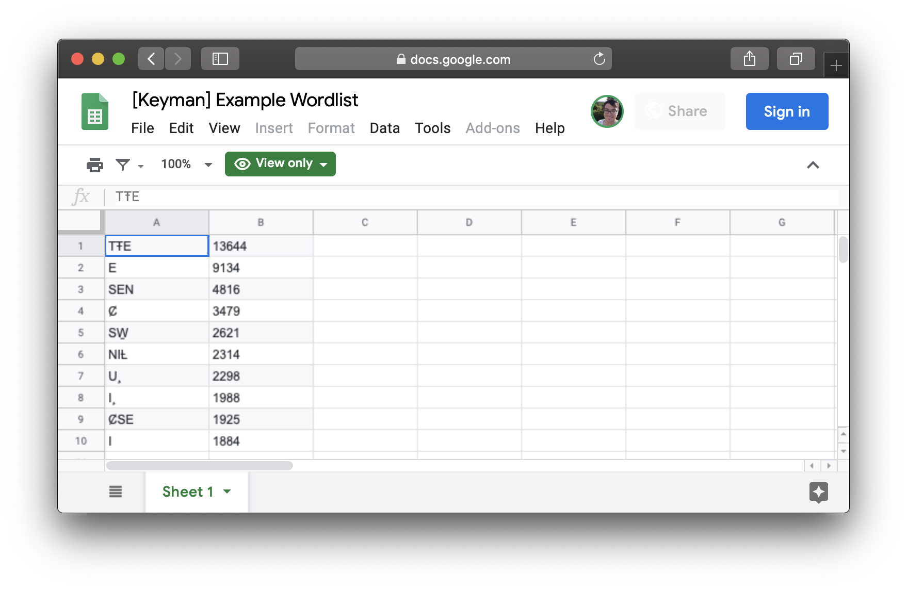
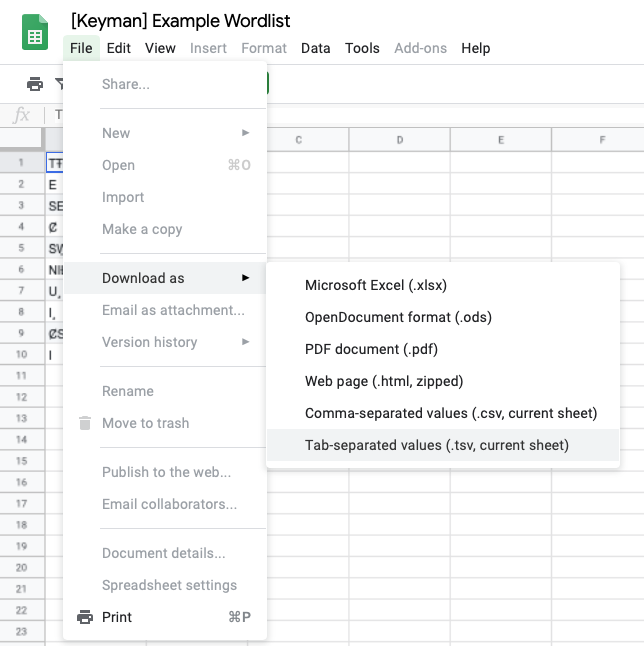

How to build a lexical model
============================

A **lexical model** or a **dictionary** is a way to enable **predictive text**
for your keyboard.

Step 1: Get some data
---------------------

To predict words in your language, a lexical model needs to know the
words in your language!

Ultimately, the **lexical model compiler** requires a tab-separated
values file, described in the [appendix][]. However, most users will use
a **spreadsheet** app like [Google Sheets][] or [Microsoft Excel][].

[Google Sheets]: https://sheets.google.com/
[Microsoft Excel]: https://products.office.com/en/excel

### Example

I have words in my language of choice, SENĆOŦEN.

Here is my list of words, with the count of how many times I've seen the
word:

| TŦE | 13644 |
| E   | 9134  |
| SEN | 4816  |
| Ȼ   | 3479  |
| SW̱  | 2621  |
| NIȽ | 2314  |
| U¸  | 2298  |
| I¸  | 1988  |
| ȻSE | 1925  |
| I   | 1884  |

I've entered this information into my spreadsheet of choice, [Google
Sheets][]. I've shared this spreadsheet publicly [here][sencoten-sheet].
The order of the columns matters.

The first column **MUST** be the words, and the second column **MUST**
be the counts. Additional columns are ignored.

This is what my word list looks like in Google Sheets:

.

[sencoten-sheet]: https://docs.google.com/spreadsheets/d/10zhIc439BCSSooL_-HeJ6TUHd-ovkiXYcIGe-pHDTSg/edit?usp=sharing

Now, we download the spreadsheet in the [required
format](#appendix:tsv). To do this, in Google Sheets, select "File"
» "Download as ⮀" » "Tab-separated values (.tsv, current sheet)".

Step 2: Fork the lexical models repository 
-------------------------------------------

Appendix: Tab-separated wordlist file format specification
----------------------------------------------------------

[appendix]: #appendix:tsv

The **lexical model compiler** expects wordlists to abide by the
following **tab-separated values** (TSV) format:

 - the file is must be **UTF-8** encoded text file
 - newlines are either **LF** or **CRLF**
 - the file either consists of a **comment** or an **entry**
 - **comment** lines MUST start with the '#' character on the very first column
 - **entries** are one or two columns, separated by the (horizontal)
   **tab character** (U+0009)
 - column 1 (REQUIRED): the **word form**: can have any character
   except tab, CR, or LF. Surrounding whitespace characters are trimmed.
 - column 2 (optional): the **count**: a non-negative integer specifying how many
   times this entry has appeared in the corpus. Blank means
   'indeterminate', and is treated as if the word exists in the corpus,
   but will be predicted at the lowest possible priority.
 - the following columns are ignored.

> Source:
> [build-trie.js@e58173f](https://github.com/keymanapp/keyman/blob/307436e7c24caa5c720b272640184362c4dc3223/developer/js/lexical-model-compiler/build-trie.ts#L21-L66)

Exporting a spreadsheet from Google Sheets as a TSV will produce
properly formatted output. I have not found a reliable output option in
Microsoft Excel for Mac that will produce output in the expected format.
